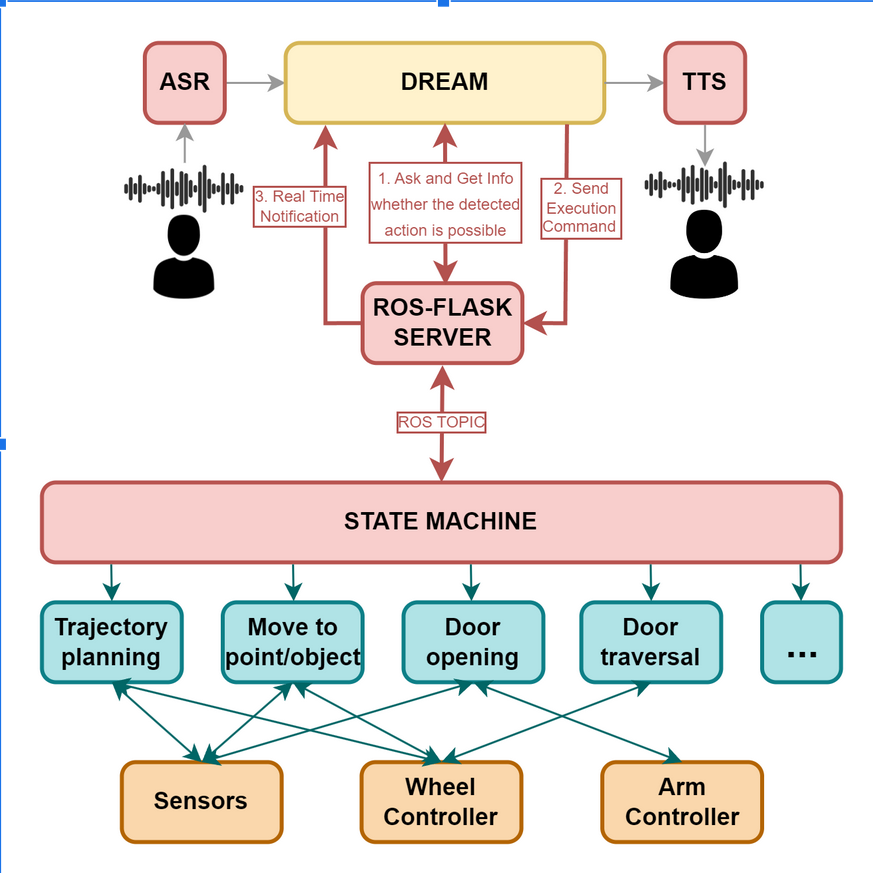

Этот репо посвящён нашему роботу, которого мы строим. В [нашем слаке](https://deeppavlov.slack.com/archives/C02J4CZ37GF) запинены еженедельные слайды и ссылка на зум.

# deployment scheme

# codebase

[**todo: Complete deployment tutorial**]()

## Components
### Dream
- [ASR](https://github.com/Petilia/const_voice_flow)
- [DREAM (custom distribution)](https://github.com/Petilia/dream/tree/dream_robot)
- TTS **todo: ссылка**

### Robot
#### Logic
- [ROS-FLASK SERVER](https://github.com/linukc/strategic_node) **todo: репо приватный, что в нём?**

- Trajectory planning: 
  - [Frontier-based exploration + Планировщик](https://github.com/alstar8/Husky_ddppo)
  - Mapping (our modification of original rtabmap ([1](https://github.com/introlab/rtabmap),[2](https://github.com/introlab/rtabmap_ros)))
      - [rtabmap + semantics](https://github.com/andrey1908/rtabmap) **todo: какие ещё тут фичи добавлены**
      - [rtabmap ROS + semantics](https://github.com/andrey1908/rtabmap_ros) **todo: какие ещё тут фичи добавлены**
      - [launch files + guide](https://github.com/andrey1908/rtabmap_example) **todo: README**
  - [Лидарная локализация: a_lego_loam](https://gitlab.com/sdbcs-nio3/itl_mipt/slam/alg/a_lego_loam) **todo: репо приватный, что в нём?**
  - [Lol](https://gitlab.com/sdbcs-nio3/itl_mipt/slam/alg/lol) **todo: репо приватный, что в нём?**
- Move to point/object [**todo**]
- Door opening [[контроллер Мухаммада]](https://github.com/MuhammadAlhaddad/door_operations)
- Door traversal  [**todo**]

#### Devices
- Контроллер колёс [[custom]](https://github.com/andrey1908/strl_robotics)
- Контроллер манипулятора [**todo**]\
   поставлен c Хаски?
- Контроллеры сенсоров [**todo**]\
   поставлены c Хаски?

## Administration
### Tests
[Тесты соединения робот-сервер](https://github.com/danissomo/robot-server-connection-test/)

### Monitoring
Http сервер с клиентом для хаски через njrok, который показывает топик status
https://github.com/danissomo/husky_status_server

# Список дел:
- [ ] закрыть тудушки в тексте этого документа
- [ ] часть кода недоступна, что с этим делать?
- [ ] fill the missing codes links
- [ ] create the deployment tutorial
  - [ ] automate the deployment where possible
